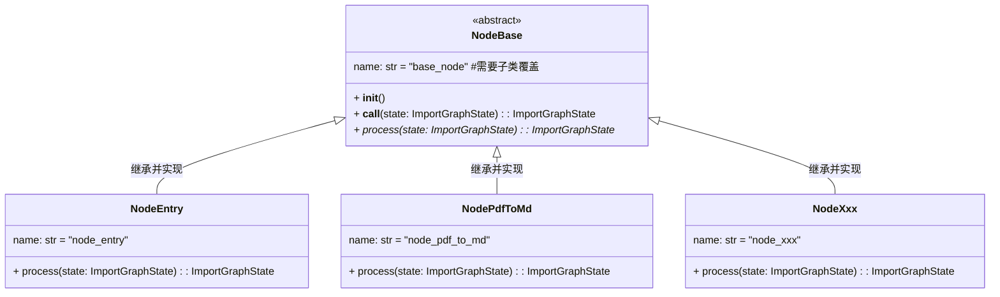
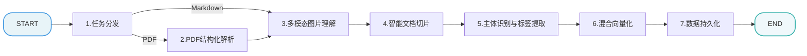
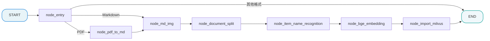

[TOC]

# 【导入】骨架代码

> 本文档详细介绍知识库导入流程的骨架代码设计与实现。

## 第1章 骨架代码

### 1.1 骨架模块职责

| 模块              | 职责                           | 重要性   |
| ----------------- | ------------------------------ | -------- |
| **state.py**      | 定义图状态结构，节点间数据传递 | 数据契约 |
| **base.py**       | 定义节点基类，统一执行逻辑     | 代码复用 |
| **nodes**         | 定义节点，定义核心业务逻辑     | 业务逻辑 |
| **logger.py**     | 统一日志配置                   | 代码复用 |
| **main_graph.py** | 构建工作流图，编排节点执行顺序 | 流程编排 |

### 1.2 全局日志(logger.py)

```python
# atguigu/tool/logger.py

import logging
import colorlog

logger = logging.getLogger()
logger.setLevel(logging.INFO)

handler = colorlog.StreamHandler()
handler.setFormatter(colorlog.ColoredFormatter(
    '%(log_color)s%(asctime)s - %(filename)s:%(lineno)d - %(levelname)s - %(message)s',
    datefmt='%Y-%m-%d %H:%M:%S',
    log_colors={
        'DEBUG': 'cyan',
        'INFO': 'green',
        'WARNING': 'yellow',
        'ERROR': 'red',
        'CRITICAL': 'bold_red',
    }
))

# logger.handlers.clear()
logger.addHandler(handler)
```

### 1.3 状态定义模块 (state.py)

所有节点共享同一个状态对象。我们需要定义它来存储处理过程中的数据（如 PDF 路径、MD 内容、切片列表、向量等）。

```python
# atguigu/import_process/state.py

from typing import TypedDict

class ImportGraphState(TypedDict):
    """
    图的状态定义，包含所有节点产生和消费的数据字段
    """
    task_id: str # 任务唯一ID，用于追踪日志

    #流程控制标记
    is_md_read_enabled: bool    # 是否启用 Markdown 读取路径
    is_pdf_read_enabled: bool   # 是否启用 PDF 读取路径

    # 路径相关
    local_dir: str  # 当前工作目录或输出目录
    local_file_path: str    # 原始输入文件路径
    file_title: str # 文件标题（文件名去后缀）
    pdf_path: str   # PDF 文件路径 (如果输入是PDF)
    md_path: str    # Markdown 文件路径 (转换后或直接输入的)

    # 内容数据
    md_content: str # Markdown 的全文内容
    chunks: list    # 切片列表
    item_name:str # 识别主体的名称（例如：万用表）

    # 数据库关联
    embeddings_content: list # 包含向量数的列表 ，准备写入 Milvus
```

### 1.4 节点基类模块 (base.py)

`NodeBase` 是基于 Python ABC 实现的导入流程抽象基类，核心设计目标是 “复用通用逻辑、约束子类行为”：

- **通用逻辑封装**：`__call__` 方法统一处理节点执行的日志、任务追踪、异常捕获，降低子类开发成本；
- **子类约束**：通过 `__init__` 强制子类覆盖 `name` 属性，通过 `@abstractmethod` 要求子类实现核心业务方法 `process`；



```python
# atguigu/import_process/base.py

from abc import ABC, abstractmethod

from atguigu.import_process.state import ImportGraphState
from atguigu.tool.logger import logger

"""
查询流程节点基类
定义统一的节点接口规范，提供通用功能
"""
class NodeBase(ABC):

    name: str = "node_base"  # 节点名称，子类应覆盖

    def __init__(self):
        """
        强制子类设置 name
        """
        if self.name == "node_base":
            raise ValueError(f"子类 {self.__class__.__name__} 必须覆盖 name 类属性")


    def __call__(self, state: ImportGraphState) -> ImportGraphState:
        """
        节点执行入口
        """
        try:
            # 1. 开始准备执行节点
            logger.info(f"--- {self.name} 开始啦 ---")

            # 2. 执行节点
            result = self.process(state)

            # 3. 执行节点成功
            logger.info(f"--- {self.name} 完成啦 ---")

            return result

        except Exception as e:
            logger.error(f"{self.name} 执行失败: {e}")
            raise

    @abstractmethod
    def process(self, state: ImportGraphState) -> ImportGraphState:
        """
        节点核心处理逻辑
        子类必须实现此方法
        :param state: 工作流状态对象
        :return: 更新后的状态对象
        """
        pass
```

### 1.5 测试节点

```python
# atguigu/import_process/nodes/node_test.py

import json
from atguigu.import_process.base import NodeBase
from atguigu.import_process.state import ImportGraphState
from atguigu.tool.logger import logger


class NodeTest(NodeBase):
    """
    节点功能：测试
    """

    # 覆盖基类的 name 属性，标识节点名称
    name: str = "node_test"

    def process(self, state: ImportGraphState) -> ImportGraphState:

        logger.info(f"【{self.name}】节点逻辑")

        return state

if __name__ == "__main__":

    # 初始化图状态
    init_state = {"local_file_path": r"D:\doc\hak180产品安全手册.pdf"}

    # 创建节点对象
    node_test = NodeTest()
    # 执行节点的单元测试
    result = node_test(init_state)
    # 将返回的图状态进行json序列化
    json_state = json.dumps(result, ensure_ascii=False, indent=4)
    # 输出
    logger.info(json_state)
```

## 第2章 知识库导入业务处理流程

### 2.1 整体流程



### 2.2 节点(nodes)

#### 2.2.1 目标

- 定义工作流需要的所有节点骨架
- 确认每个节点的输入输出

#### 2.2.2 需求分析

所有的节点包含：

- `node_entry`任务分发
- `node_pdf_to_md`pdf结构化解析
- `node_md_img`多模态图片理解
- `node_document_split`智能文档切片 
- `node_item_name_recognition`主体识别与标签提取
-  `node_bge_embedding`混合向量化 
- `node_import_milvus`数据持久化

#### 2.2.3 代码实现

##### NodeEntry

```python
# atguigu/import_process/nodes/node_entry.py
from atguigu.import_process.base import NodeBase
from atguigu.import_process.state import ImportGraphState


class NodeEntry(NodeBase):
    """
    入口节点：任务分发
    """

    name = "node_entry"

    def process(self, state: ImportGraphState):

        return state
```

##### NodePDFToMD

```python
# atguigu/import_process/nodes/node_pdf_to_md.py
from atguigu.import_process.base import NodeBase
from atguigu.import_process.state import ImportGraphState


class NodePDFToMD(NodeBase):
    """
    PDF 转 Markdown 节点：PDF结构化解析
    """

    name = "node_pdf_to_md"

    def process(self, state: ImportGraphState):

        return state
```

##### NodeMDImg

```python
# atguigu/import_process/nodes/node_md_img.py
from atguigu.import_process.base import NodeBase
from atguigu.import_process.state import ImportGraphState


class NodeMDImg(NodeBase):
    """
    MarkDown图片处理节点：多模态图片理解
    """

    name = "node_md_img"

    def process(self, state: ImportGraphState):


        return state
```

##### NodeDocumentSplit

```python
# atguigu/import_process/nodes/node_document_split.py
from atguigu.import_process.base import NodeBase
from atguigu.import_process.state import ImportGraphState


class NodeDocumentSplit(NodeBase):
    """
    文档切分节点：智能文档切片
    """

    name = "node_document_split"

    def process(self, state: ImportGraphState):


        return state
```

##### NodeItemNameRecognition

```python
# atguigu/import_process/nodes/node_item_name_recognition.py
from atguigu.import_process.base import NodeBase
from atguigu.import_process.state import ImportGraphState


class NodeItemNameRecognition(NodeBase):
    """
    主体识别节点：主体识别与标签提取
    """

    name = "node_item_name_recognition"

    def process(self, state: ImportGraphState):


        return state
```

##### NodeBGEEmbedding

```python
# atguigu/import_process/nodes/node_bge_embedding.py
from atguigu.import_process.base import NodeBase
from atguigu.import_process.state import ImportGraphState


class NodeBGEEmbedding(NodeBase):
    """
    混合向量化节点：使用 BGE-M3 模型将文本转换为向量
    """

    name = "node_bge_embedding"

    def process(self, state: ImportGraphState):


        return state
```

##### NodeImportMilvus

```python
# atguigu/import_process/nodes/node_import_milvus.py
from atguigu.import_process.base import NodeBase
from atguigu.import_process.state import ImportGraphState


class NodeImportMilvus(NodeBase):
    """
    导入向量库节点：数据持久化
    """

    name = "node_import_milvus"

    def process(self, state: ImportGraphState):


        return state
```

### 2.3 主图 (main_graph.py)

#### 2.3.1 目标

- 构建完整的导入工作流图
- 定义节点执行顺序和条件路由
- 提供便捷的测试入口

#### 2.3.2 需求分析

**流程结构：**

1. **入口节点**：`node_entry` 检测文件类型
2. **条件路由**：PDF → `node_pdf_to_md`；MD → `node_md_img`；其他 → `END`
3. **顺序执行**：`node_md_img` → `node_document_split` → `node_item_name_recognition` → `node_bge_embedding` → `node_import_milvus`
4. **结束节点**：`END`



#### 2.3.3 代码实现

##### 主流程

```python
from langgraph.constants import END
from langgraph.graph import StateGraph

from atguigu.import_process.nodes.node_bge_embedding import NodeBGEEmbedding
from atguigu.import_process.nodes.node_document_split import NodeDocumentSplit
from atguigu.import_process.nodes.node_entry import NodeEntry
from atguigu.import_process.nodes.node_import_milvus import NodeImportMilvus
from atguigu.import_process.nodes.node_item_name_recognition import NodeItemNameRecognition
from atguigu.import_process.nodes.node_md_img import NodeMDImg
from atguigu.import_process.nodes.node_pdf_to_md import NodePDFToMD
from atguigu.import_process.state import ImportGraphState


class ImportMainGraphRunner:
    def __init__(self):
        self.builder = StateGraph(state_schema=ImportGraphState)
        self.add_nodes()
        self.add_edges()
        self.graph = None


    def add_nodes(self):
        self.builder.add_node(NodeEntry.name, NodeEntry())
        self.builder.add_node(NodePDFToMD.name, NodePDFToMD())
        self.builder.add_node(NodeMDImg.name, NodeMDImg())
        self.builder.add_node(NodeDocumentSplit.name, NodeDocumentSplit())
        self.builder.add_node(NodeItemNameRecognition.name, NodeItemNameRecognition())
        self.builder.add_node(NodeBGEEmbedding.name, NodeBGEEmbedding())
        self.builder.add_node(NodeImportMilvus.name, NodeImportMilvus())

    def add_edges(self):
        self.builder.set_entry_point(NodeEntry.name)
        self.builder.add_conditional_edges(NodeEntry.name, self.after_entry_router,{
            NodePDFToMD.name: NodePDFToMD.name,
            NodeMDImg.name: NodeMDImg.name
        })
        self.builder.add_edge(NodePDFToMD.name, NodeMDImg.name)
        self.builder.add_edge(NodeMDImg.name, NodeDocumentSplit.name)
        self.builder.add_edge(NodeDocumentSplit.name,NodeItemNameRecognition.name)
        self.builder.add_edge(NodeItemNameRecognition.name,NodeBGEEmbedding.name)
        self.builder.add_edge(NodeBGEEmbedding.name,NodeImportMilvus.name)
        self.builder.add_edge(NodeImportMilvus.name,END)


    def after_entry_router(self, state: ImportGraphState):
        is_md_read_enabled = state.get("is_md_read_enabled", False)
        is_pdf_read_enabled = state.get("is_pdf_read_enabled", False)

        if is_pdf_read_enabled:
            return NodePDFToMD.name
        elif is_md_read_enabled:
            return NodeMDImg.name
        else:
            return END


    def run(self, state: ImportGraphState):
        if self.graph is None:
            self.graph = self.builder.compile()
        result = self.graph.invoke(state)
        return result


    @classmethod
    def create_and_run(cls, state: ImportGraphState):
        return cls().run(state)


if __name__ == '__main__':
    init_state = {
        "local_file_path":r"D:\output\hak180产品安全手册.md"
    }
    result = ImportMainGraphRunner.create_and_run(init_state)
    print(result)


```

##### 修改NodeEntry

添加路由逻辑

```python
# atguigu/import_process/nodes/node_entry.py
from pathlib import Path

from atguigu.import_process.base import NodeBase
from atguigu.import_process.state import ImportGraphState


class NodeEntry(NodeBase):
    """
    入口节点：任务分发
    """

    name = "node_entry"

    def process(self, state: ImportGraphState):
        local_file_path = state.get("local_file_path",'')
        if not local_file_path:
            raise ValueError("缺少文件路径")

        local_file_path_obj = Path(local_file_path)

        if not local_file_path_obj.exists():
            raise FileNotFoundError(f"文件不存在：{local_file_path}")

        file_title = local_file_path_obj.stem
        suffix = local_file_path_obj.suffix

        if suffix.lower() == ".pdf":
            return {
                "is_pdf_read_enabled": True,
                "file_title": file_title,
                "pdf_path": str(local_file_path_obj)
            }

        elif suffix.lower() == ".md":
            state["is_md_read_enabled"] = True
            state["file_title"] = file_title
            state["md_path"] = str(local_file_path_obj)
            return state
        else:
            raise ValueError(f"不支持的文件类型：{suffix}")

if __name__ == '__main__':
    node = NodeEntry()
    init_state = {
        "local_file_path":r"D:\output\hak180产品安全手册.pdf"
    }
    result = node(init_state)
    print(result)

```
