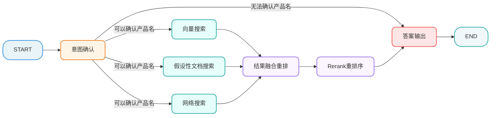
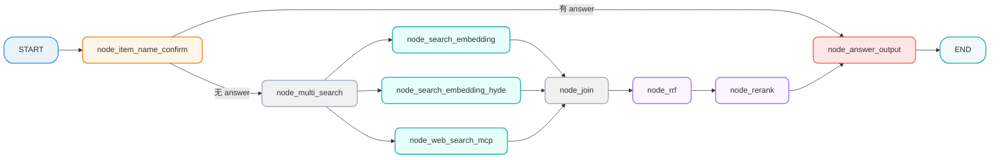
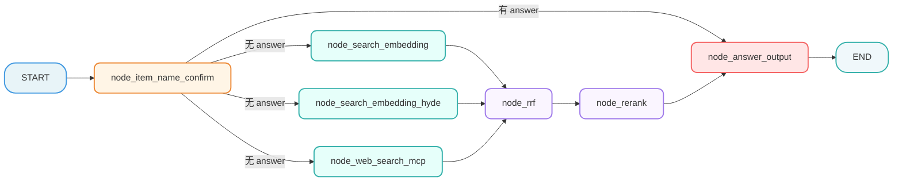

[TOC]

# 【检索】骨架代码 

> 本文档详细介绍知识库检索流程的骨架代码设计与实现，包括状态定义、节点基类和流程图构建。

## 第1章 骨架代码

### 1.1 骨架模块职责

| 模块              | 职责                           | 重要性   |
| ----------------- | ------------------------------ | -------- |
| **state.py**      | 定义图状态结构，节点间数据传递 | 数据契约 |
| **base.py**       | 定义节点基类，统一执行逻辑     | 代码复用 |
| **nodes**         | 定义节点，定义核心业务逻辑     | 业务逻辑 |
| **main_graph.py** | 构建工作流图，编排节点执行顺序 | 流程编排 |

### 1.2 状态定义模块 (state.py)

```python
# atguigu/query_process/state.py

from typing import TypedDict, List

class QueryGraphState(TypedDict):
    """
    查询流程图状态
    包含整个查询流程中传递的所有数据。
    """

    session_id: str  # 会话ID
    message_id: str  # 消息ID

    original_query: str  # 用户原始问题

    # 检索过程中的中间数据
    embedding_chunks: list  # 普通向量检索回来的切片
    hyde_embedding_chunks: list  # 已向量化的假设性问题切片
    web_search_docs: list  # 网络搜索回来的文档

    # 排序过程中的数据
    rrf_chunks: list  # RRF 融合排序后的切片
    reranked_docs: list  # 重排序后的最终 Top-K 文档

    # 生成过程中的数据
    prompt: str  # 组装好的 Prompt
    answer: str  # 最终生成的答案

    # 辅助信息
    item_names: List[str]  # 提取出的商品名称
    rewritten_query: str  # 改写后的问题
    history: list  # 历史对话记录
```

### 1.3 节点基类模块 (base.py)

```python
# atguigu/query_process/base.py

"""
查询流程节点基类

定义统一的节点接口规范，提供通用功能
"""
from abc import abstractmethod, ABC

from atguigu.query_process.state import QueryGraphState
from atguigu.tool.logger import logger


class NodeBase(ABC):

    name: str = "node_base"

    def __init__(self):
        """
        强制子类设置name
        """
        if self.name == "node_base":
            raise ValueError(f"{self.__class__.__name__} 必须设置 name 属性")

    def __call__(self, state: QueryGraphState):
        """
        节点执行入口
        """
        try:
            logger.info(f"{self.name} 开始执行...")

            result = self.process(state)

            logger.info(f"{self.name} 结束执行...")

            return result
        except Exception as e:
            logger.error(f"{self.name} 执行失败: {e}")
            raise

    @abstractmethod
    def process(self, state: QueryGraphState):
        """
        节点的核心处理逻辑
        :return:
        """
        pass
```

## 第2章 知识库查询业务流程

### 2.1 整体流程

**业务流程**



### 2.2 节点

#### 2.2.1 意图确认

 `node_item_name_confirm.py`

这个节点主要干了 4 件事：

1. 提取与改写 ：结合历史对话提取商品名，并将模糊问题改写为完整独立的精准问题。
2. 向量化检索 ：将提取出的商品名在 Milvus 向量库中进行混合搜索。
3. 标准化对齐 ：根据评分高低自动对齐标准型号，或生成反问让用户手动确认。
4. 同步历史记录 ：将改写后的问题、确认的商品名和处理状态实时写入 MongoDB 数据库。

```python
# atguigu/query_process/nodes/node_item_name_confirm.py

import json

from atguigu.query_process.base import NodeBase
from atguigu.query_process.state import QueryGraphState
from atguigu.tool.logger import logger

class NodeItemNameConfirm(NodeBase):
    """
    节点功能：确认用户问题中的核心商品名称。
    """

    # 覆盖基类的 name 属性，标识节点名称
    name: str = "node_item_name_confirm"

    def process(self, state: QueryGraphState):
        """
        节点逻辑
        :param state: 工作流状态对象
        :return: 更新后的状态对象
        """

        logger.info(f"【{self.name}】节点逻辑")

        return state
```

#### 2.2.2 向量检索

`node_search_embedding.py`

这个节点负责根据 改写后的用户问题 ，在 限定的商品范围内 ，利用 BGEM3 混合检索（稠密+稀疏） 技术，从 Milvus 向量数据库中召回 Top5 最相关的知识切片。

```python
# atguigu/query_process/nodes/node_search_embedding.py

from atguigu.query_process.base import NodeBase
from atguigu.query_process.state import QueryGraphState
from atguigu.tool.logger import logger

class NodeSearchEmbedding(NodeBase):
     """
    节点功能：基于已确认主体名+改写后的用户问题，执行Milvus向量数据库混合检索
    """

     # 覆盖基类的 name 属性，标识节点名称
     name: str = "node_search_embedding"

     def process(self, state: QueryGraphState):
         """
         节点逻辑
         :param state: 工作流状态对象
         :return: 更新后的状态对象
         """

         # TODO
         logger.info(f"【{self.name}】节点逻辑")

         # return state
         return {"embedding_chunks":  []}
```

#### 2.2.3 HyDE 假设检索节点

`node_search_embedding_hyde.py`

这个节点实现了 HyDE (Hypothetical Document Embeddings) 策略，核心逻辑是 先让 LLM 虚构一个“理想答案”，再用这个答案去向量库检索真实的文档 。

它通过“LLM 生成假设性答案”来增强原始问题的语义信息，再进行混合向量检索，从而大幅提升对“语义匹配但字面不匹配”问题的召回能力。

```python
# atguigu/query_process/nodes/node_search_embedding_hyde.py

from atguigu.query_process.base import NodeBase
from atguigu.query_process.state import QueryGraphState
from atguigu.tool.logger import logger

class NodeSearchEmbeddingHyde(NodeBase):
    """
    节点功能：HyDE (Hypothetical Document Embedding)
    先让 LLM 生成假设性答案，再对答案进行向量检索，提高召回率。
    """

    # 覆盖基类的 name 属性，标识节点名称
    name: str = "node_search_embedding_hyde"

    def process(self, state: QueryGraphState):
        """
        节点逻辑
        :param state: 工作流状态对象
        :return: 更新后的状态对象
        """

        # TODO
        logger.info(f"【{self.name}】节点逻辑")

        # return state
        return {"hyde_embedding_chunks": []}
```

#### 2.2.4 网络搜索节点

`node_web_search_mcp.py`

这个节点 负责调用 百炼 MCP (Model Context Protocol) 联网搜索服务 ，获取互联网上的实时信息。

它通过 MCP 协议异步调用百炼联网搜索接口，将用户的查询转化为实时的、结构化的网络搜索结果（包含标题、链接和摘要）。

```python
# atguigu/query_process/nodes/node_web_search_mcp.py

from atguigu.query_process.base import NodeBase
from atguigu.query_process.state import QueryGraphState
from atguigu.tool.logger import logger

class NodeWebSearchMcp(NodeBase):
    """
    节点功能，调用外部搜索引擎补充信息
    """

    # 覆盖基类的 name 属性，标识节点名称
    name: str = "node_web_search_mcp"

    def process(self, state: QueryGraphState):
        """
        节点逻辑
        :param state: 工作流状态对象
        :return: 更新后的状态对象
        """

        # TODO
        logger.info(f"【{self.name}】节点逻辑")

        # return state
        return {"web_search_docs": []}
```

#### 2.2.5 倒排融合排序节点:

`node_rrf.py`

这个节点负责将来自不同检索源（如向量检索、HyDE 检索、知识图谱等）的文档列表进行统一合并和重新排序 。它消除了不同检索方式的分数差异，给出一个综合排名最高的文档列表（Top 10）。

```python
# atguigu/query_process/nodes/node_rrf.py

from atguigu.query_process.base import NodeBase
from atguigu.query_process.state import QueryGraphState
from atguigu.tool.logger import logger

class NodeRrf(NodeBase):
    """
    节点功能：Reciprocal Rank Fusion
    将多路召回的结果（向量、HyDE、Web）进行加权融合排序。
    """

    # 覆盖基类的 name 属性，标识节点名称
    name: str = "node_rrf"

    def process(self, state: QueryGraphState):
        """
        节点逻辑
        :param state: 工作流状态对象
        :return: 更新后的状态对象
        """

        # TODO
        logger.info(f"【{self.name}】节点逻辑")

        return state
```

#### 2.2.6 重排序节点

`node_rerank.py`

这个节点是知识库检索的“精修师”，它对之前所有步骤召回的文档进行 二次精细排序 。

```python
# atguigu/query_process/nodes/node_rerank.py

from atguigu.query_process.base import NodeBase
from atguigu.query_process.state import QueryGraphState
from atguigu.tool.logger import logger

class NodeRerank(NodeBase):
    """
    节点功能：使用 Cross-Encoder 模型对 RRF 后的结果进行精确打分重排。
    """

    # 覆盖基类的 name 属性，标识节点名称
    name: str = "node_rerank"

    def process(self, state: QueryGraphState):
        """
        节点逻辑
        :param state: 工作流状态对象
        :return: 更新后的状态对象
        """

        # TODO
        logger.info(f"【{self.name}】节点逻辑")

        return state
```

#### 2.2.7 答案生成

`node_answer_output.py`

这个节点是知识库查询的“最后一公里”，负责生成最终回答并交付给用户 。

```python
# atguigu/query_process/nodes/node_answer_output.py

from atguigu.query_process.base import NodeBase
from atguigu.query_process.state import QueryGraphState
from atguigu.tool.logger import logger

class NodeAnswerOutput(NodeBase):
    """
    节点功能: 答案生成
    """

    # 覆盖基类的 name 属性，标识节点名称
    name: str = "node_answer_output"

    def process(self, state: QueryGraphState):
        """
        节点逻辑
        :param state: 工作流状态对象
        :return: 更新后的状态对象
        """

        # TODO
        logger.info(f"【{self.name}】节点逻辑")

        return state
```

### 2.3 主图

#### 2.3.1 V1



#### 2.3.2 V2



```python
from langgraph.constants import END
from langgraph.graph import StateGraph

from atguigu.query_process.nodes.node_answer_output import NodeAnswerOutput
from atguigu.query_process.nodes.node_item_name_confirm import NodeItemNameConfirm
from atguigu.query_process.nodes.node_rerank import NodeRerank
from atguigu.query_process.nodes.node_rrf import NodeRrf
from atguigu.query_process.nodes.node_search_embedding import NodeSearchEmbedding
from atguigu.query_process.nodes.node_search_embedding_hyde import NodeSearchEmbeddingHyde
from atguigu.query_process.nodes.node_web_search_mcp import NodeWebSearchMcp
from atguigu.query_process.state import QueryGraphState
from atguigu.tool.json_format_tool import json_format
from atguigu.tool.logger import logger


class QueryMainGraphRunner:
    def __init__(self):
        self.builder = StateGraph(state_schema=QueryGraphState)
        self.add_nodes()
        self.add_edges()
        self.graph = None

    def add_nodes(self):
        self.builder.add_node(NodeItemNameConfirm.name, NodeItemNameConfirm())
        self.builder.add_node(NodeSearchEmbedding.name, NodeSearchEmbedding())
        self.builder.add_node(NodeSearchEmbeddingHyde.name, NodeSearchEmbeddingHyde())
        self.builder.add_node(NodeWebSearchMcp.name, NodeWebSearchMcp())
        self.builder.add_node(NodeRrf.name, NodeRrf())
        self.builder.add_node(NodeRerank.name, NodeRerank())
        self.builder.add_node(NodeAnswerOutput.name, NodeAnswerOutput())

    def after_item_name_confirm_router(self, state: QueryGraphState):
        answer = state.get("answer", "")
        if answer:
            return NodeAnswerOutput.name
        else:
            return [NodeSearchEmbeddingHyde.name, NodeSearchEmbedding.name,NodeWebSearchMcp.name]

    def add_edges(self):
        self.builder.set_entry_point(NodeItemNameConfirm.name)
        self.builder.add_conditional_edges(NodeItemNameConfirm.name, self.after_item_name_confirm_router)
        self.builder.add_edge(NodeSearchEmbeddingHyde.name, NodeRrf.name)
        self.builder.add_edge(NodeSearchEmbedding.name, NodeRrf.name)
        self.builder.add_edge(NodeWebSearchMcp.name, NodeRrf.name)
        self.builder.add_edge(NodeRrf.name,NodeRerank.name)
        self.builder.add_edge(NodeRerank.name,NodeAnswerOutput.name)
        self.builder.add_edge(NodeAnswerOutput.name,END)

    def run(self,state):
        if self.graph is None:
            self.graph = self.builder.compile()
        result = self.graph.invoke(state)
        return result

    @classmethod
    def create_and_run(cls,state):
        return cls().run(state)

if __name__ == '__main__':
    runner = QueryMainGraphRunner()
    init_state = {
        # "answer": "haha",
    }
    result = runner.run(init_state)
    logger.info(json_format(result))

```
